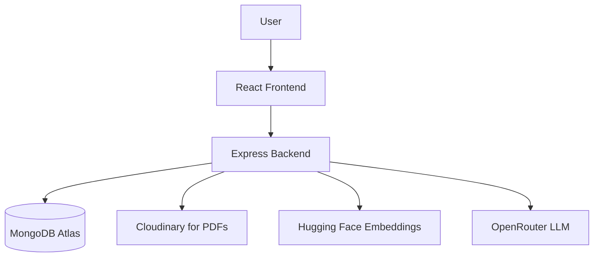
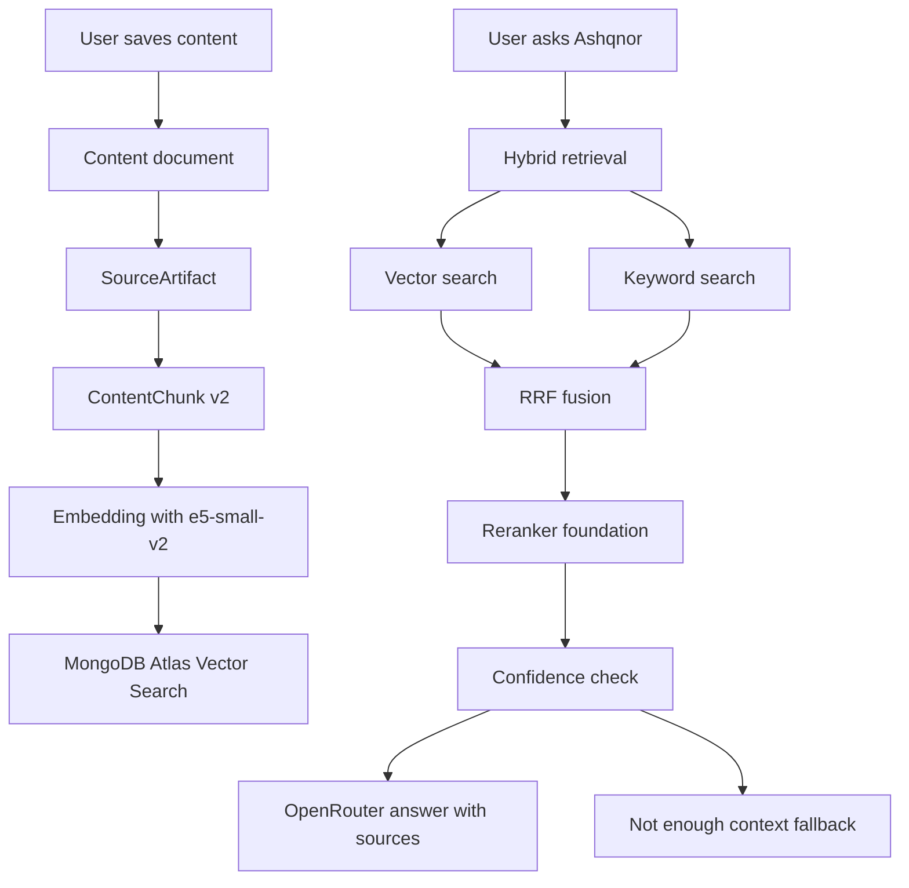
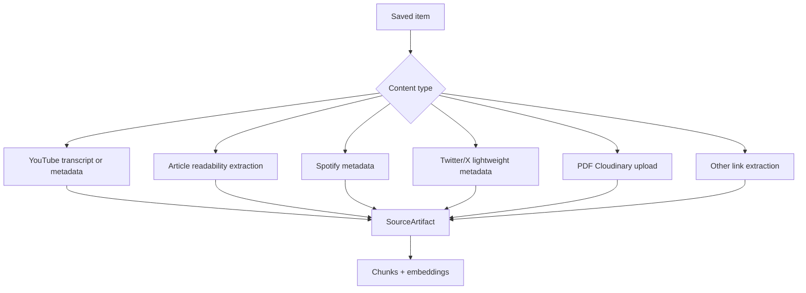
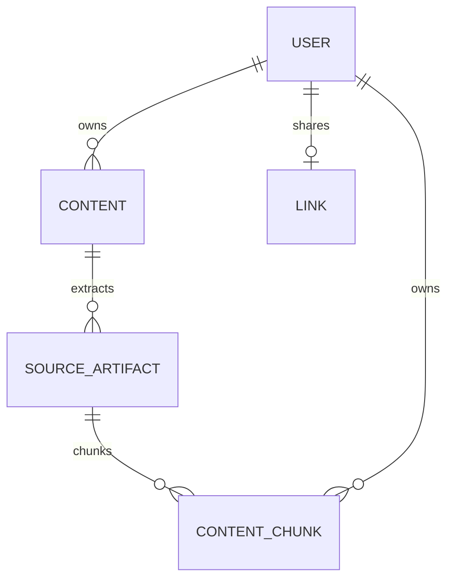

# Concious

Concious is a full-stack second-brain platform where users save links, media, PDFs, and personal context in one dashboard, then search and chat over that saved knowledge with a RAG-backed assistant.

## Features

- User authentication (signup, signin, JWT-protected dashboard)
- Dashboard for saved content with create, edit, delete, and type filters
- Supported content types: YouTube, Twitter/X, Spotify, Article, PDF, Other
- Optional user context on each item: personal note, summary, tags, collection, importance, and remember-this-for (`whySaved`)
- PDF upload to Cloudinary with in-dashboard viewer (iframe or new tab)
- Semantic search over saved knowledge (hybrid retrieval)
- Ashqnor RAG chatbot with source-backed answers
- Confidence fallback when retrieved context is too weak
- Public shared brain link for read-only content sharing
- Background indexing pipeline: Content → SourceArtifact → ContentChunk v2

## Tech Stack

**Frontend**

- React
- TypeScript
- Vite
- Tailwind CSS
- TanStack React Query
- Axios

**Backend**

- Node.js
- Express
- TypeScript
- MongoDB
- Mongoose
- JWT auth
- Cloudinary
- Multer

**AI / RAG**

- Hugging Face embeddings: `intfloat/e5-small-v2`
- MongoDB Atlas Vector Search
- OpenRouter (`mistralai/mistral-small-3.1-24b-instruct`)
- Hybrid retrieval (vector + keyword)
- Reciprocal Rank Fusion (RRF)
- Reranker foundation (Hugging Face cross-encoder, with RRF fallback)

## Current Architecture



## RAG Workflow



## Content Ingestion Workflow



Platform extraction behavior:

- **YouTube:** transcript when available, with metadata fallback
- **Article:** Mozilla Readability extraction from the saved URL
- **Spotify:** oEmbed metadata, with optional Spotify Web API enrichment
- **Twitter/X:** lightweight oEmbed / Open Graph metadata
- **PDF:** file stored in Cloudinary; metadata and user context indexed only (no PDF text parsing)
- **Other:** article-style URL extraction when a link is present

## Database Model Summary

- **User** — authenticated account
- **Content** — saved item/card (title, link, type, user context, optional `fileMetadata` for PDFs)
- **SourceArtifact** — raw or skipped extraction output per content item (metadata, transcripts, article text, etc.)
- **ContentChunk** — searchable RAG chunks with embeddings (v2 structured fields)
- **Link** — public shared-brain hash for a user



## PDF Behavior

- PDFs are uploaded through `POST /api/v1/content/pdf` and stored in Cloudinary.
- The Cloudinary secure URL is saved on the `Content` document (`link` and `fileMetadata`).
- PDFs can be viewed from the dashboard (iframe viewer or open in a new tab).
- PDFs are searchable by title, tags, summary, personal note, collection, importance, and other user-provided context.
- PDF text extraction and PDF body chunking are **not** part of the current implementation. A `pdf_text` SourceArtifact is recorded as skipped during indexing.

## Project Structure

```text
.
├── concious_backend/      # Express + TypeScript API
│   ├── src/
│   │   ├── rag/           # indexing, retrieval, RRF, reranker, extractors
│   │   ├── services/
│   │   ├── controllers/
│   │   └── routes/
│   ├── .env.example
│   └── package.json
├── concious_frontend/     # React + Vite client
│   ├── src/
│   ├── .env.example
│   └── package.json
├── package.json           # npm workspaces root
└── README.md
```

## Environment Variables

### Backend (`concious_backend/.env`)

| Variable | Required | Description |
| --- | --- | --- |
| `PORT` | No | API port (default `3000`) |
| `MONGO_URI` | Yes | MongoDB connection string |
| `JWT_PASSWORD` | Yes | Secret for signing JWT tokens |
| `HF_API_KEY` | Yes* | Hugging Face API key for embeddings (and optional reranker) |
| `HF_EMBEDDING_MODEL` | No | Embedding model (default `intfloat/e5-small-v2`) |
| `OPENROUTER_API_KEY` | Yes* | OpenRouter API key for Ashqnor chat |
| `OPENROUTER_MODEL` | No | Chat model (default `mistralai/mistral-small-3.1-24b-instruct`) |
| `CLOUDINARY_CLOUD_NAME` | For PDF upload | Cloudinary cloud name |
| `CLOUDINARY_API_KEY` | For PDF upload | Cloudinary API key |
| `CLOUDINARY_API_SECRET` | For PDF upload | Cloudinary API secret |
| `HF_RERANK_MODEL` | No | Optional reranker model (default `BAAI/bge-reranker-base`) |
| `SPOTIFY_CLIENT_ID` | No | Optional Spotify Web API client ID |
| `SPOTIFY_CLIENT_SECRET` | No | Optional Spotify Web API client secret |

\*Required for semantic search, indexing, and chat to work with embeddings/LLM. Without keys, lexical fallbacks may still return limited results.

Example:

```env
PORT=3000
MONGO_URI=mongodb+srv://<user>:<password>@<cluster>/<db>
JWT_PASSWORD=replace-with-a-long-random-secret
HF_API_KEY=hf_xxxxxxxxxxxxxxxxx
HF_EMBEDDING_MODEL=intfloat/e5-small-v2
OPENROUTER_API_KEY=sk-or-v1-xxxxxxxxxxxxxxxxx
OPENROUTER_MODEL=mistralai/mistral-small-3.1-24b-instruct
CLOUDINARY_CLOUD_NAME=your-cloud-name
CLOUDINARY_API_KEY=your-api-key
CLOUDINARY_API_SECRET=your-api-secret
# HF_RERANK_MODEL=BAAI/bge-reranker-base
# SPOTIFY_CLIENT_ID=
# SPOTIFY_CLIENT_SECRET=
```

### Frontend (`concious_frontend/.env`)

| Variable | Required | Description |
| --- | --- | --- |
| `VITE_BACKEND_URL` | No | Backend base URL (default `http://localhost:3000`) |

## MongoDB Atlas Vector Search Indexes

Create these indexes before relying on semantic search or chat retrieval.

**`contents` collection** — legacy document-level fallback

- Index name: `vector_idx`
- Field: `embedding`
- Dimensions: `384`
- Similarity: `cosine`

```json
{
  "fields": [
    {
      "type": "vector",
      "path": "embedding",
      "numDimensions": 384,
      "similarity": "cosine"
    }
  ]
}
```

**`contentchunks` collection** — primary chunk-level retrieval

- Index name: `chunk_vector_idx`
- Field: `embedding`
- Dimensions: `384`
- Similarity: `cosine`
- Filter field: `userId`

```json
{
  "fields": [
    {
      "type": "vector",
      "path": "embedding",
      "numDimensions": 384,
      "similarity": "cosine"
    },
    {
      "type": "filter",
      "path": "userId"
    }
  ]
}
```

## Local Setup

### Prerequisites

- Node.js 20+
- npm 10+
- MongoDB (local or Atlas)
- Hugging Face API key (embeddings)
- OpenRouter API key (chat)
- Cloudinary credentials (PDF upload only)

### Install from repository root (workspaces)

```bash
npm install
```

### Backend

```bash
cd concious_backend
cp .env.example .env
npm install
npm run build
npm run dev
```

### Frontend

```bash
cd concious_frontend
cp .env.example .env
npm install
npm run build
npm run dev
```

### Run both from root (optional)

```bash
npm run dev:backend
npm run dev:frontend
```

## Available Scripts

From the repository root:

```bash
npm run dev:backend
npm run dev:frontend
npm run build
npm run build:backend
npm run build:frontend
npm run lint:frontend
```

## API Overview

| Method | Route | Purpose |
| --- | --- | --- |
| `POST` | `/api/v1/signup` | Create an account |
| `POST` | `/api/v1/signin` | Sign in and receive a JWT |
| `GET` | `/api/v1/content` | List authenticated user's content |
| `POST` | `/api/v1/content` | Create link-based content |
| `POST` | `/api/v1/content/pdf` | Upload PDF (multipart/form-data) |
| `PATCH` | `/api/v1/content/:id` | Update content metadata |
| `DELETE` | `/api/v1/content/:id` | Delete content (and Cloudinary PDF when applicable) |
| `POST` | `/api/v1/content/:id/reindex` | Reindex one content item |
| `POST` | `/api/v1/search` | Hybrid semantic + lexical search |
| `POST` | `/api/v1/chat` | Ashqnor RAG chat over saved content |
| `POST` | `/api/v1/reindex-embeddings` | Reindex all user content |
| `POST` | `/api/v1/brain/share` | Create or remove a public share link |
| `GET` | `/api/v1/brain/:shareLink` | Read a shared public brain |

Protected routes expect the JWT in the `authorization` request header.

## Search And Chat Behavior

- **Search** uses hybrid chunk retrieval (vector + keyword), RRF fusion, and legacy content-level fallback when needed.
- **Ashqnor chat** uses hybrid retrieval, RRF, reranker foundation, a confidence threshold, and OpenRouter generation with retrieved snippets as context.
- When confidence is too low, Ashqnor returns a fallback message instead of inventing an answer.
- Retrieved content is treated as untrusted reference material in the LLM system prompt (prompt-injection boundary).

## Security Notes

- Keep `.env` files out of Git.
- Use a strong `JWT_PASSWORD` in every environment.
- Do not commit database credentials or API keys.
- Rotate Hugging Face, OpenRouter, and Cloudinary keys if exposed.

## License

MIT License — see [LICENSE](LICENSE).

Copyright (c) 2026 Anukool Pandey
