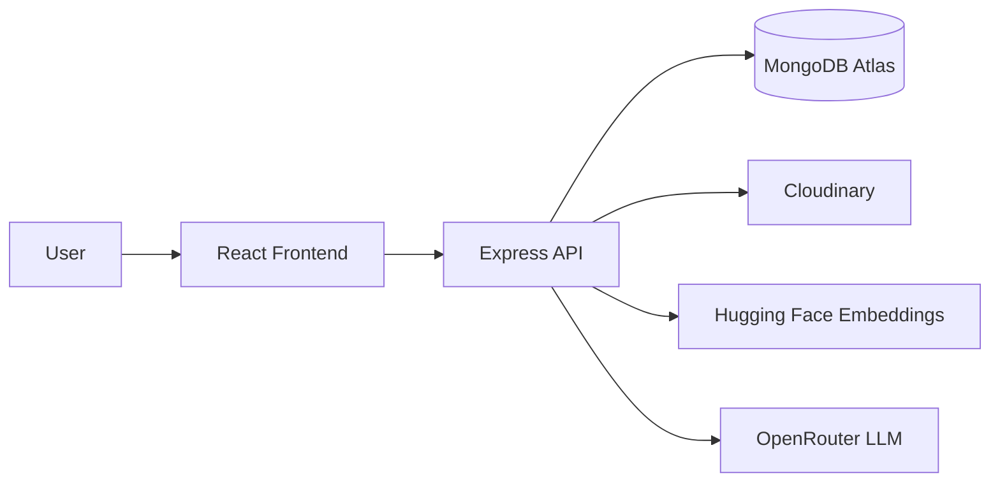
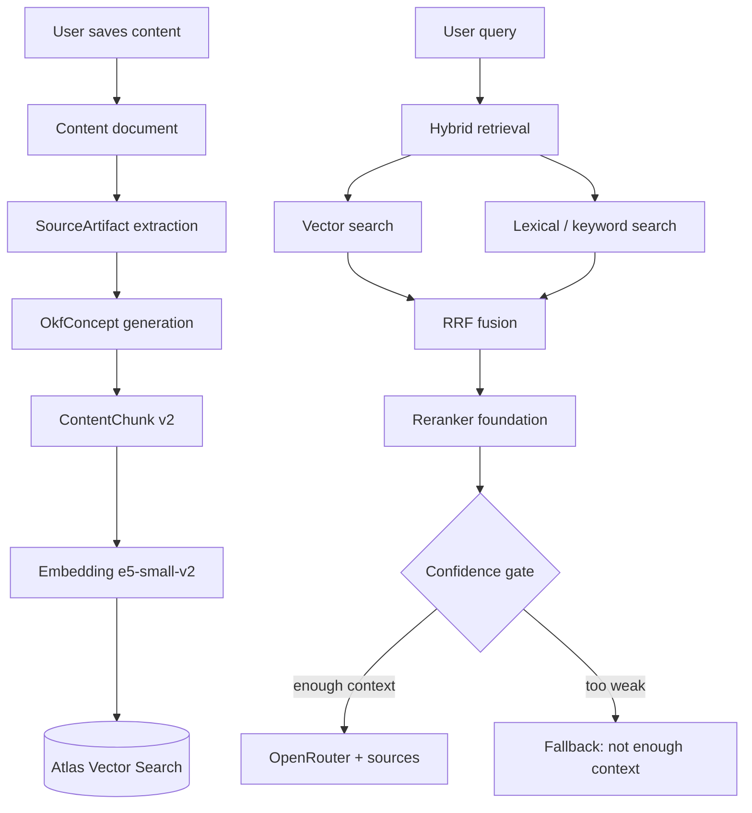
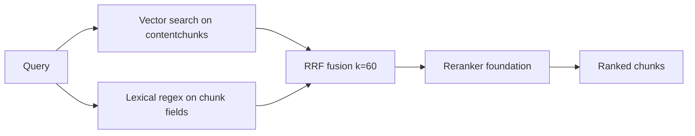
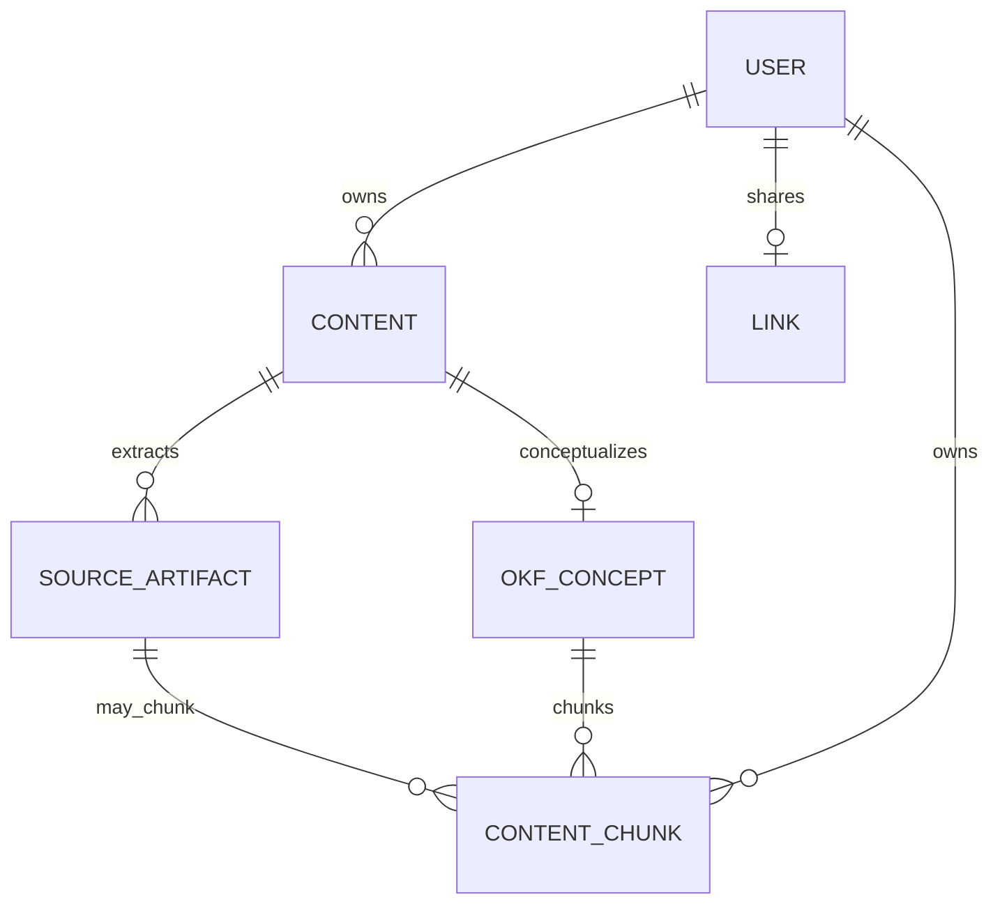

# Concious

**A second brain for the modern internet.**

Concious helps you capture what you consume — links, videos, audio, articles, and PDFs — then retrieve and think over that knowledge with a RAG-backed assistant named **Ashqnor**.

Save with intent. Search by meaning. Chat with your library.

---

## Table of contents

1. [Features](#features)
2. [Tech stack](#tech-stack)
3. [System architecture](#system-architecture)
4. [RAG architecture](#rag-architecture)
5. [Data model](#data-model)
6. [Project structure](#project-structure)
7. [Environment variables](#environment-variables)
8. [MongoDB Atlas vector indexes](#mongodb-atlas-vector-indexes)
9. [Local setup](#local-setup)
10. [API overview](#api-overview)
11. [Security notes](#security-notes)
12. [License](#license)

---

## Features

- **Auth** — signup, signin, JWT-protected dashboard
- **Dashboard** — create, edit, delete, filter, and sort saved content
- **Content types** — YouTube, Twitter/X, Spotify, Article, PDF, Other
- **User context** — personal note, summary, tags, collection, importance, and *remember this for* (`whySaved`)
- **PDF upload** — Cloudinary storage with in-dashboard viewer
- **Semantic search** — hybrid vector + keyword retrieval over your library
- **Ashqnor chat** — source-backed answers with confidence fallback
- **Shared brain** — public read-only link to your saved content
- **Background indexing** — Content → SourceArtifact → OKF Concept → ContentChunk v2

---

## Tech stack

| Layer | Stack |
| --- | --- |
| **Frontend** | React, TypeScript, Vite, Tailwind CSS, TanStack Query, Axios, Framer Motion, GSAP |
| **Backend** | Node.js, Express, TypeScript, MongoDB, Mongoose, JWT, Cloudinary, Multer |
| **Embeddings** | Hugging Face `intfloat/e5-small-v2` (384-dim) |
| **Vector store** | MongoDB Atlas Vector Search |
| **LLM** | OpenRouter (`mistralai/mistral-small-3.1-24b-instruct`) |
| **Retrieval** | Hybrid (vector + lexical) → RRF → reranker foundation → confidence gate |

---

## System architecture



| Piece | Role |
| --- | --- |
| Frontend | Landing, auth, dashboard, semantic search UI, Ashqnor chat |
| Express API | Auth, content CRUD, PDF upload, indexing triggers, search, chat, share links |
| MongoDB | Users, content, artifacts, OKF concepts, chunks + vectors, share hashes |
| Cloudinary | PDF file storage |
| Hugging Face | Chunk embeddings (+ optional cross-encoder rerank) |
| OpenRouter | Ashqnor answer generation |

---

## RAG architecture

Concious treats every saved item as knowledge to index, not just a bookmark.

### Pipeline at a glance

```text
Save content
    ↓
Extract SourceArtifacts (platform + metadata)
    ↓
Generate OkfConcept (structured markdown note)
    ↓
Chunk → embed (e5-small-v2) → ContentChunk v2
    ↓
Store in MongoDB Atlas Vector Search
    ↓
Query: hybrid retrieve → RRF → rerank → confidence → answer / fallback
```



### 1. Indexing (ingest)

Triggered asynchronously after create / update / PDF upload / reindex.

| Step | What happens |
| --- | --- |
| 1. Reset | Delete existing chunks, artifacts, and OKF for that content |
| 2. Metadata artifact | Build searchable text from title, tags, note, summary, collection, importance, `whySaved` |
| 3. Platform extract | Detect type/URL → YouTube / Article / Spotify / Twitter / PDF / Other extractor |
| 4. OKF generate | Build a structured markdown “concept note” from artifacts + user context |
| 5. Chunk | Split OKF (and body) into v2 chunks (~900 chars, 120 overlap, max 10) |
| 6. Embed | Hugging Face `intfloat/e5-small-v2` → 384-dim vectors |
| 7. Persist | Write `ContentChunk` rows; mark content `indexingStatus` |

**Chunk shape (v2)**

Each chunk stores structured fields used for both vector and keyword search:

- `body` — chunk body text
- `metadataText` — user/context prefix
- `chunkText` — `Context: …` + `Chunk Content: …` (what gets embedded)
- `sourceType` — e.g. `okf_concept`, `youtube_transcript`, `metadata`
- `embedding`, `embeddingModel`, `embeddingDimension`, `chunkingVersion`

### 2. OKF concept layer

**OKF** (Obsidian-style Knowledge Format) is an intermediate knowledge object between raw extraction and chunks.

```text
SourceArtifacts + user context
        ↓
   OkfConcept
   (title, slug, summary, bodyMarkdown, tags, frontmatter)
        ↓
   OKF markdown chunks → embeddings
```

Why it exists:

- Normalizes messy platform text into one readable concept note
- Preserves user intent (notes, tags, “remember this for”)
- Gives retrieval a cleaner, more consistent surface than raw transcripts alone

### 3. Platform extraction

| Type | Behavior |
| --- | --- |
| **YouTube** | Transcript when available; metadata fallback |
| **Article** | Mozilla Readability extraction from the URL |
| **Spotify** | oEmbed metadata (+ optional Spotify Web API enrichment) |
| **Twitter/X** | Lightweight oEmbed / Open Graph metadata |
| **PDF** | Uploaded to Cloudinary; metadata + user context indexed only (**no PDF body text parsing**) |
| **Other** | Article-style URL extraction when a link is present |

### 4. Retrieval (search + Ashqnor)



| Stage | Detail |
| --- | --- |
| **Vector** | Atlas Vector Search on `contentchunks.embedding`, filtered by `userId` |
| **Lexical** | Regex over title, body, metadata, chunkText, type |
| **RRF** | Reciprocal Rank Fusion (`k = 60`) merges both ranked lists |
| **Reranker** | Hugging Face cross-encoder foundation (`BAAI/bge-reranker-base`); falls back to RRF order if unavailable |
| **Diversity** | Chat path selects diverse chunks / dedupes sources by content |

**Search** (`POST /api/v1/search`) — hybrid chunk retrieval + RRF; legacy content-level fallback when needed.

**Ashqnor** (`POST /api/v1/chat`) — reranked hybrid retrieval → confidence check → OpenRouter generation with retrieved snippets as untrusted reference context.

### 5. Confidence gate

Ashqnor only answers when top context clears a score threshold:

| Retrieval type | Minimum top score |
| --- | --- |
| Vector / hybrid | `0.65` |
| Lexical-only | `0.86` |

If context is too weak:

> *I don't have enough relevant information in your saved knowledge base to answer that confidently.*

This reduces hallucination when the library has no relevant material.

### 6. RAG module map (`concious_backend/src/rag/`)

| File | Responsibility |
| --- | --- |
| `01_platform.ts` | Detect platform, normalize URL, hostname |
| `02_metadata.ts` | Build metadata text from user fields |
| `03_scraper.ts` | Readable article extraction |
| `04_youtube.ts` | YouTube ID + transcript |
| `05_spotify.ts` | Spotify metadata |
| `06_twitter.ts` | Twitter/X metadata |
| `07_extractors.ts` | Route content → platform extractors |
| `08_chunker.ts` | Structured chunking (size / overlap / max) |
| `09_indexer.ts` | Full index pipeline (artifacts → OKF → chunks → embed) |
| `10_retrieval.ts` | Vector, lexical, hybrid, reranked retrieval helpers |
| `11_rrf.ts` | Reciprocal Rank Fusion |
| `12_reranker.ts` | Cross-encoder rerank foundation |
| `13_confidence.ts` | Chat confidence thresholds + fallback copy |
| `index.ts` | Public exports |

Supporting packages:

| Path | Role |
| --- | --- |
| `src/okf/` | OKF concept generation, markdown chunking, slugs |
| `src/providers.ts` | Hugging Face embeddings + OpenRouter client |
| `src/services/search.service.ts` | Search API orchestration |
| `src/services/chat.service.ts` | Ashqnor orchestration + prompt boundary |

---

## Data model



| Collection | Purpose |
| --- | --- |
| **User** | Account (username + password hash) |
| **Content** | Saved card — title, link, type, user context, `fileMetadata`, indexing status, optional legacy embedding |
| **SourceArtifact** | Raw / skipped extraction output (transcript, article text, metadata, PDF skip marker, etc.) |
| **OkfConcept** | Structured markdown concept note derived from artifacts + user context |
| **ContentChunk** | Searchable RAG units with embeddings (primary retrieval surface) |
| **Link** | Public shared-brain hash for a user |

### PDF behavior

- Upload via `POST /api/v1/content/pdf` → Cloudinary
- Secure URL stored on `Content` (`link` + `fileMetadata`)
- Viewable in dashboard (iframe or new tab)
- Searchable via title, tags, summary, notes, collection, importance, and other user context
- **PDF text extraction / body chunking is not implemented** — a `pdf_text` artifact is recorded as skipped

---

## Project structure

```text
.
├── concious_backend/                 # Express + TypeScript API
│   ├── src/
│   │   ├── rag/                      # Numbered RAG pipeline modules
│   │   ├── okf/                      # OKF concept generation
│   │   ├── services/                 # Content, search, chat, brain
│   │   ├── controllers/
│   │   ├── routes/
│   │   ├── middleware/
│   │   ├── providers.ts              # HF + OpenRouter
│   │   └── db.ts                     # Mongoose models
│   ├── .env.example
│   └── package.json
├── concious_frontend/                # React + Vite client
│   ├── src/
│   │   ├── Pages/                    # Landing, auth, dashboard
│   │   ├── components/               # UI, Ashqnor, search, share
│   │   ├── sections/                 # Landing sections
│   │   └── api/
│   ├── .env.example
│   └── package.json
├── package.json                      # npm workspaces root
└── README.md
```

---

## Environment variables

### Backend (`concious_backend/.env`)

| Variable | Required | Description |
| --- | --- | --- |
| `PORT` | No | API port (default `3000`) |
| `MONGO_URI` | Yes | MongoDB connection string |
| `JWT_PASSWORD` | Yes | JWT signing secret |
| `HF_API_KEY` | Yes* | Hugging Face key for embeddings (and optional reranker) |
| `HF_EMBEDDING_MODEL` | No | Default `intfloat/e5-small-v2` |
| `OPENROUTER_API_KEY` | Yes* | OpenRouter key for Ashqnor |
| `OPENROUTER_MODEL` | No | Default `mistralai/mistral-small-3.1-24b-instruct` |
| `CLOUDINARY_CLOUD_NAME` | For PDFs | Cloudinary cloud name |
| `CLOUDINARY_API_KEY` | For PDFs | Cloudinary API key |
| `CLOUDINARY_API_SECRET` | For PDFs | Cloudinary API secret |
| `HF_RERANK_MODEL` | No | Default `BAAI/bge-reranker-base` |
| `SPOTIFY_CLIENT_ID` | No | Optional Spotify Web API |
| `SPOTIFY_CLIENT_SECRET` | No | Optional Spotify Web API |

\*Needed for full semantic search, indexing, and chat. Without keys, limited lexical fallbacks may still work.

```env
PORT=3000
MONGO_URI=mongodb+srv://<user>:<password>@<cluster>/<db>
JWT_PASSWORD=replace-with-a-long-random-secret
HF_API_KEY=hf_xxxxxxxxxxxxxxxxx
HF_EMBEDDING_MODEL=intfloat/e5-small-v2
OPENROUTER_API_KEY=sk-or-v1-xxxxxxxxxxxxxxxxx
OPENROUTER_MODEL=mistralai/mistral-small-3.1-24b-instruct
CLOUDINARY_CLOUD_NAME=your-cloud-name
CLOUDINARY_API_KEY=your-api-key
CLOUDINARY_API_SECRET=your-api-secret
# HF_RERANK_MODEL=BAAI/bge-reranker-base
# SPOTIFY_CLIENT_ID=
# SPOTIFY_CLIENT_SECRET=
```

### Frontend (`concious_frontend/.env`)

| Variable | Required | Description |
| --- | --- | --- |
| `VITE_BACKEND_URL` | No | Backend base URL (default `http://localhost:3000`) |

---

## MongoDB Atlas vector indexes

Create these before relying on semantic search or Ashqnor.

### `contents` — legacy document-level fallback

- **Index name:** `vector_idx`
- **Path:** `embedding`
- **Dimensions:** `384`
- **Similarity:** `cosine`

```json
{
  "fields": [
    {
      "type": "vector",
      "path": "embedding",
      "numDimensions": 384,
      "similarity": "cosine"
    }
  ]
}
```

### `contentchunks` — primary chunk retrieval

- **Index name:** `chunk_vector_idx`
- **Path:** `embedding`
- **Dimensions:** `384`
- **Similarity:** `cosine`
- **Filter:** `userId`

```json
{
  "fields": [
    {
      "type": "vector",
      "path": "embedding",
      "numDimensions": 384,
      "similarity": "cosine"
    },
    {
      "type": "filter",
      "path": "userId"
    }
  ]
}
```

---

## Local setup

### Prerequisites

- Node.js 20+
- npm 10+
- MongoDB (local or Atlas)
- Hugging Face API key
- OpenRouter API key
- Cloudinary credentials (PDF upload only)

### Install (workspaces root)

```bash
npm install
```

### Backend

```bash
cd concious_backend
cp .env.example .env
npm install
npm run build
npm run dev
```

### Frontend

```bash
cd concious_frontend
cp .env.example .env
npm install
npm run build
npm run dev
```

### From root

```bash
npm run dev:backend
npm run dev:frontend
```

### Scripts

| Script | Purpose |
| --- | --- |
| `npm run dev:backend` | Run API |
| `npm run dev:frontend` | Run Vite client |
| `npm run build` | Build backend + frontend |
| `npm run build:backend` | Build API only |
| `npm run build:frontend` | Build client only |
| `npm run lint:frontend` | Lint frontend |

---

## API overview

| Method | Route | Purpose |
| --- | --- | --- |
| `POST` | `/api/v1/signup` | Create account |
| `POST` | `/api/v1/signin` | Sign in → JWT |
| `GET` | `/api/v1/content` | List user content |
| `POST` | `/api/v1/content` | Create link-based content |
| `POST` | `/api/v1/content/pdf` | Upload PDF (multipart) |
| `PATCH` | `/api/v1/content/:id` | Update content |
| `DELETE` | `/api/v1/content/:id` | Delete content (+ Cloudinary PDF if needed) |
| `POST` | `/api/v1/content/:id/reindex` | Reindex one item |
| `POST` | `/api/v1/search` | Hybrid semantic + lexical search |
| `POST` | `/api/v1/chat` | Ashqnor RAG chat |
| `POST` | `/api/v1/reindex-embeddings` | Reindex all user content |
| `POST` | `/api/v1/brain/share` | Create / remove public share link |
| `GET` | `/api/v1/brain/:shareLink` | Read shared brain |

Protected routes expect the JWT in the `authorization` header.

### Search & chat behavior

- **Search** — hybrid chunk retrieval + RRF; legacy content-level fallback when needed
- **Ashqnor** — hybrid → RRF → rerank → confidence → OpenRouter with sources
- Retrieved text is treated as **untrusted reference material** in the system prompt (prompt-injection boundary)
- Weak context → explicit fallback instead of inventing an answer

---

## Security notes

- Keep `.env` files out of Git
- Use a strong `JWT_PASSWORD` in every environment
- Never commit database credentials or API keys
- Rotate Hugging Face, OpenRouter, and Cloudinary keys if exposed

---

## License

MIT License — see [LICENSE](LICENSE).

Copyright (c) 2026 Anukool Pandey
