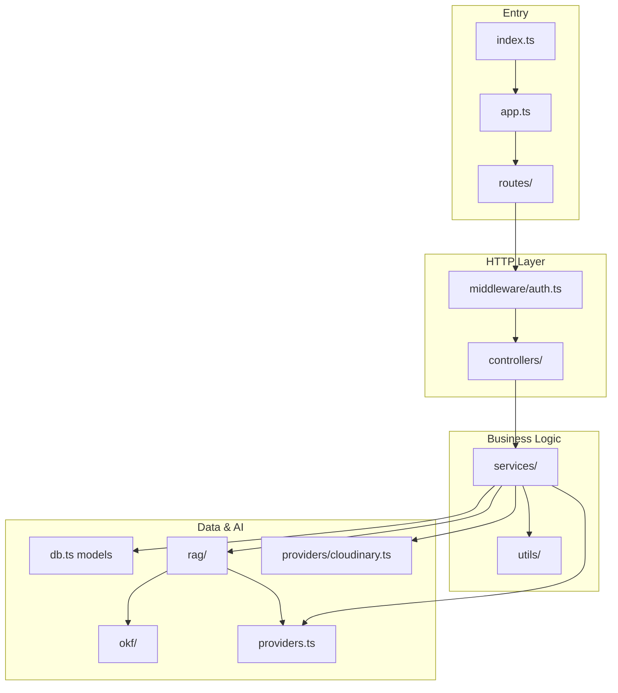

---
tags:
  - conscious
  - interview-prep
  - backend
aliases:
  - Backend Structure
  - Part 1
part: 1
prev: "[[00 - Interview Prep Index]]"
next: "[[02 - RAG Architecture Overview]]"
---

# Part 1 — Backend Folder Structure

← [[00 - Interview Prep Index]] | Next: [[02 - RAG Architecture Overview]]

Full map of `concious_backend/` — what each folder/file does, how layers connect, and reading order for interview prep.

---

## Top-level layout

```text
concious_backend/
├── .env                    # Secrets & config (Mongo, JWT, HF, OpenRouter, Spotify, Cloudinary)
├── .env.example            # Template for required env vars
├── package.json            # Dependencies & scripts (build → start)
├── package-lock.json
├── tsconfig.json           # TypeScript compile config (output → dist/)
├── tsconfig.tsbuildinfo    # TS incremental build cache
└── src/                    # All application code
```

### Scripts (`package.json`)

| Script | What it does |
|--------|--------------|
| `npm run build` | Compiles TypeScript → `dist/` |
| `npm run start` | Runs `dist/index.js` with `.env` |
| `npm run dev` | Build + start (local development) |

**Stack:** Express 5, Mongoose (MongoDB), JWT + bcrypt, HuggingFace (embeddings + rerank), OpenRouter (LLM), Cloudinary (PDFs), Zod (auth validation).

---

## `src/` — application layers

Classic **Route → Controller → Service** pattern, with RAG and AI in separate modules.

```text
src/
├── index.ts              # Server entry: connect DB, listen on PORT
├── app.ts                # Express app setup (JSON, CORS, mount /api/v1)
├── config.ts             # All env variables in one place
├── db.ts                 # MongoDB connection + all Mongoose models
├── providers.ts          # HuggingFace embeddings/rerank + OpenRouter LLM
├── utils.ts              # Small shared helper (random hash for share links)
│
├── express/types/        # TypeScript extensions for Express Request
├── middleware/           # Auth gate + PDF upload handling
├── routes/               # HTTP route definitions (thin)
├── controllers/          # Parse request, call service, send response
├── services/             # Business logic (content, search, chat, auth, brain)
├── types/                # Shared TypeScript types
├── utils/                # Query parsing, ranking, conversational helpers
├── providers/            # External service: Cloudinary PDF storage
├── rag/                  # RAG pipeline (index + retrieve)
└── okf/                  # OKF concept generation + chunking
```

---

## Root `src/` files

| File | Role |
|------|------|
| `index.ts` | Starts server: `connectDB()` → `app.listen(PORT)` |
| `app.ts` | Express app, `express.json()` + `cors()`, mounts routes at `/api/v1` |
| `config.ts` | `PORT`, `MONGO_URI`, `JWT_PASSWORD`, HF models, OpenRouter, Spotify, Cloudinary |
| `db.ts` | Database layer — 5 Mongoose models + `connectDB()` |
| `providers.ts` | `getHfEmbedding()`, `rerankWithHf()`, `askOpenRouter()`, `askOpenRouterConversational()` |
| `utils.ts` | `random(len)` — share-link hash generator |

### `db.ts` — MongoDB models

| Model | Collection | Purpose |
|-------|------------|---------|
| `UserModel` | `users` | username + hashed password |
| `ContentModel` | `contents` | Saved item (title, link, type, notes, tags, legacy embedding, indexing status) |
| `SourceArtifactModel` | `sourceartifacts` | Raw extracted source text (metadata, transcript, article, etc.) |
| `OkfConceptModel` | `okfconcepts` | Structured markdown knowledge doc per content item |
| `ContentChunkModel` | `contentchunks` | **RAG search units** — chunked text + vector embeddings |
| `LinkModel` | `links` | Public share hash for shared brain feature |

Related: [[02 - RAG Architecture Overview]] for how these collections connect in the pipeline.

---

## `express/types/`

```text
express/types/
└── index.d.ts    # Adds req.userId to Express Request (set by auth middleware)
```

---

## `middleware/`

| File | Role |
|------|------|
| `auth.ts` | Reads `authorization` header, verifies JWT, sets `req.userId`. Returns 401 if missing/invalid. |
| `pdfUpload.ts` | Multer config for PDF uploads (size limit, single file field `"file"`), error handler |

Used on: content, search, chat, brain share, reindex routes.

---

## `routes/` — HTTP endpoints

| File | Mount path | Endpoints |
|------|------------|-----------|
| `index.ts` | `/api/v1` | Combines all route modules |
| `auth.routes.ts` | `/api/v1` | `POST /signup`, `POST /signin` |
| `content.routes.ts` | `/api/v1/content` | CRUD + PDF upload + reindex |
| `search.routes.ts` | `/api/v1/search` | `POST /` — semantic search |
| `chat.routes.ts` | `/api/v1/chat` | `POST /` — Ashqnor chatbot |
| `brain.routes.ts` | `/api/v1/brain` | `POST /share`, `GET /:shareLink` — public brain sharing |

### Full API map

```text
POST   /api/v1/signup
POST   /api/v1/signin

POST   /api/v1/content              # create link/content
POST   /api/v1/content/pdf          # upload PDF
GET    /api/v1/content              # list user's content
PATCH  /api/v1/content/:id          # update
DELETE /api/v1/content/:id          # delete
GET    /api/v1/content/:id/pdf      # stream PDF
POST   /api/v1/content/:id/reindex  # re-index one item

POST   /api/v1/search               # hybrid semantic search
POST   /api/v1/chat                 # Ashqnor grounded chat

POST   /api/v1/reindex-embeddings   # bulk reindex all user content
POST   /api/v1/brain/share          # enable/disable public share link
GET    /api/v1/brain/:shareLink     # public read-only shared brain (no auth)
```

---

## `controllers/` — request/response layer

Thin layer: validate input, call service, return JSON + status.

| File | Handles |
|------|---------|
| `auth.controller.ts` | signup / signin |
| `content.controller.ts` | create, list, update, delete, PDF upload/stream, reindex |
| `search.controller.ts` | search — reads `query` + `limit` from body |
| `chat.controller.ts` | chat — reads `message` from body |
| `brain.controller.ts` | share link toggle + public shared brain fetch |

Controllers never call RAG directly — always through `services/`.

---

## `services/` — business logic

| File | Responsibility |
|------|----------------|
| `auth.service.ts` | Zod validation, bcrypt hash, JWT on signup/signin |
| `content.service.ts` | Create/update/delete content, PDF upload, trigger `indexContentForRag()`, list content |
| `search.service.ts` | Hybrid search: lexical + vector chunks + RRF + legacy fallback |
| `chat.service.ts` | Ashqnor: intent routing → RAG retrieval → confidence gate → OpenRouter LLM |
| `brain.service.ts` | Generate/remove share hash, fetch public shared content |

See [[02 - RAG Architecture Overview]] for save/search/chat flows. See [[03 - Save and Index Pipeline]] for the full save → index deep dive.

---

## `types/`

| File | Role |
|------|------|
| `search.ts` | `SearchItem`, `RetrievedChunk`, `SearchResponse`, `SearchMode`, `RetrievalType` |
| `youtube-transcript.d.ts` | Type declarations for `youtube-transcript` package |

---

## `utils/`

| File | Role |
|------|------|
| `contentHelpers.ts` | Normalize tags, importance, optional text trimming |
| `contentQuery.ts` | Intent detection: "show my youtube", "explain X", category filters |
| `conversational.ts` | Small-talk detection + static responses (no RAG) |
| `searchRanking.ts` | Final score normalization, dedupe, `finalizeSearchResults()` |

Used by `search.service.ts` and `chat.service.ts` — not exposed as routes.

---

## `providers/`

| File | Role |
|------|------|
| `cloudinary.ts` | Upload/delete PDFs, config check |

Used by `content.service.ts` for PDF content type.

---

## `okf/` — structured knowledge layer

OKF = intermediate structured doc between raw artifacts and searchable chunks.

```text
okf/
├── index.ts       # Re-exports public API
├── types.ts       # OkfConceptInput, GeneratedOkfConcept, OkfMarkdownChunk, etc.
├── generator.ts   # Builds markdown knowledge doc from content + source artifacts
├── chunker.ts     # Splits OKF markdown into embeddable chunks
└── slug.ts        # URL-safe slug for OKF concept
```

**Flow:** `SourceArtifacts` → `generateOkfConcept()` → `chunkOkfMarkdown()` → embeddings in `rag/09_indexer.ts`.

---

## `rag/` — RAG engine (numbered pipeline)

Files numbered in pipeline order. `index.ts` is the public barrel export.

```text
rag/
├── index.ts           # Public exports (what services import)
│
├── 01_platform.ts     # detectPlatform(), normalizeUrl(), getHostname()
├── 02_metadata.ts     # buildMetadataText() — user fields → indexable text
├── 03_scraper.ts      # Article/web page extraction (Readability + JSDOM)
├── 04_youtube.ts      # YouTube video ID + transcript fetch
├── 05_spotify.ts      # Spotify URL parse + metadata via API/oEmbed
├── 06_twitter.ts      # Twitter/X URL parse + thread metadata
├── 07_extractors.ts   # Orchestrates platform-specific extraction per content type
├── 08_chunker.ts      # Generic text chunking (overlapping chunks)
├── 09_indexer.ts      # MAIN INDEX PIPELINE — artifacts → OKF → chunks → embeddings
├── 10_retrieval.ts    # Vector + lexical chunk search, hybrid, context builders
├── 11_rrf.ts          # Reciprocal Rank Fusion (merge vector + lexical rankings)
├── 12_reranker.ts     # HuggingFace cross-encoder reranking (chat)
└── 13_confidence.ts   # Confidence thresholds for chat context
```

### RAG phases

| Phase | Files | When |
|-------|-------|------|
| Ingest / Index | `02` → `07` → `okf/` → `09` | Content create/update (background) |
| Retrieve | `10`, `11`, `12` | Search + chat queries |
| Gate | `13` | Chat only |

---

## Layer connection diagram



---

## Service dependencies

| Service | Main imports |
|---------|--------------|
| `content.service` | `db.ts`, `rag/index.ts`, `providers.ts`, `cloudinary` |
| `search.service` | `db.ts`, `rag/index.ts`, `providers.ts`, `utils/contentQuery`, `utils/searchRanking` |
| `chat.service` | `db.ts`, `rag/index.ts`, `providers.ts`, `search.service`, `utils/*` |
| `auth.service` | `db.ts`, `config.ts`, bcrypt, jwt, zod |
| `brain.service` | `db.ts`, `utils.ts` |

---

## Reading order (interview prep)

**Day 1 — skeleton**
1. `index.ts` → `app.ts` → `routes/index.ts`
2. `middleware/auth.ts`
3. `db.ts`
4. `config.ts` + `providers.ts`

**Day 2 — save flow**
5. `routes/content.routes.ts` → `controllers/content.controller.ts` → `services/content.service.ts`
6. `rag/09_indexer.ts`
7. `rag/07_extractors.ts` + `04–06`
8. `okf/generator.ts` + `okf/chunker.ts`

**Day 3 — query flow**
9. `services/search.service.ts` + `rag/10_retrieval.ts` + `11_rrf.ts`
10. `services/chat.service.ts` + `rag/12_reranker.ts` + `13_confidence.ts`
11. `utils/contentQuery.ts` + `utils/conversational.ts`

**Day 4 — extras**
12. `services/brain.service.ts`
13. `services/auth.service.ts`

---

## Interview summary

> The backend is an Express + TypeScript API with layered structure: routes define endpoints, controllers handle HTTP, services hold business logic. Data lives in MongoDB via five Mongoose models. On save, `content.service` triggers the RAG indexer (`rag/09_indexer.ts`), which extracts platform data, builds an OKF concept, chunks it, embeds with HuggingFace, and stores in `contentchunks`. Search and chat both use `rag/10_retrieval` for hybrid vector+lexical retrieval; chat adds reranking, confidence gating, and OpenRouter for grounded answers.

---

← [[00 - Interview Prep Index]] | Next: [[02 - RAG Architecture Overview]]
