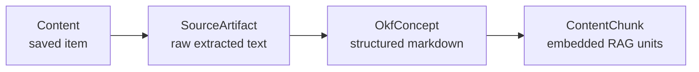
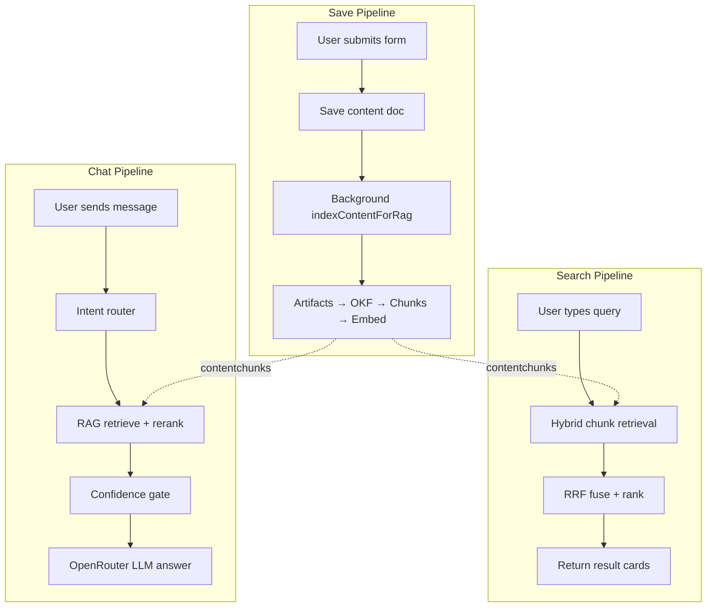
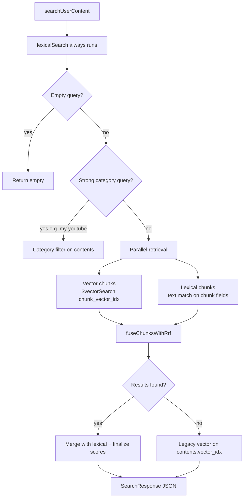
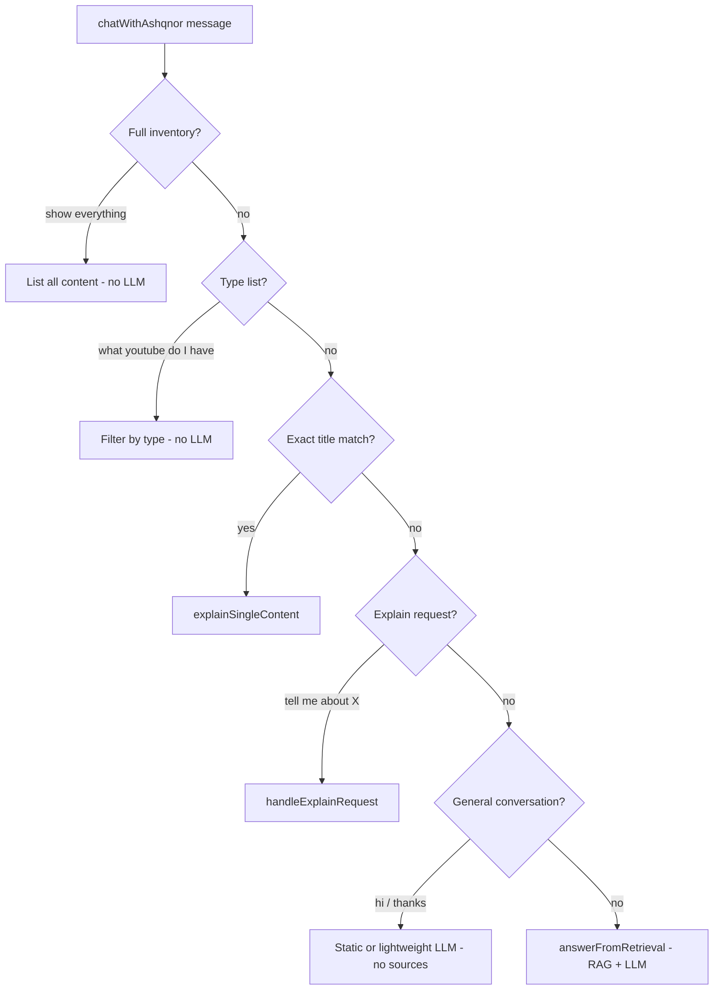
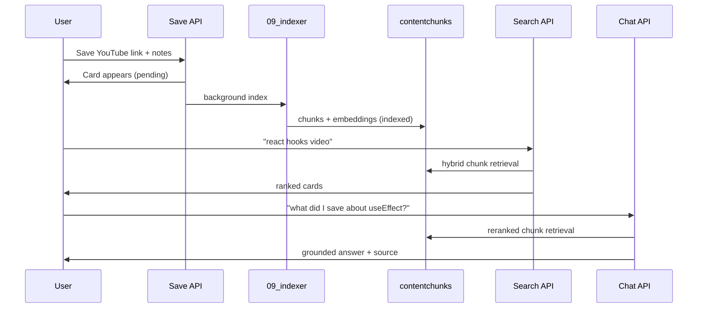

---
tags:
  - conscious
  - interview-prep
  - rag
  - architecture
aliases:
  - RAG Overview
  - Part 2
part: 2
prev: "[[01 - Backend Folder Structure]]"
next: "[[03 - Save and Index Pipeline]]"
---

# Part 2 — RAG Architecture Overview

← [[00 - Interview Prep Index]] | Prev: [[01 - Backend Folder Structure]] | Next: [[03 - Save and Index Pipeline]]

High-level map of how **save**, **search**, and **chat** connect — plus a **code walkthrough** (Checkpoint 0–9) with exact files and line numbers to open while reading. Read this before [[03 - Save and Index Pipeline]].

---

## What is Conscious RAG?

Conscious is a personal **Second Brain**. Users save links, videos, articles, PDFs, and notes. The backend:

1. **Indexes** saved items into searchable vector chunks (background)
2. **Search** finds matching items via hybrid semantic + keyword retrieval
3. **Chat (Ashqnor)** answers questions grounded in retrieved chunks + OpenRouter LLM

All three paths share the same MongoDB collections and `rag/` modules.

---

## The four MongoDB layers



| Collection | What it stores | Used by |
|------------|----------------|---------|
| `contents` | Title, link, type, notes, tags, legacy whole-item embedding, `indexingStatus` | Dashboard list, legacy vector fallback |
| `sourceartifacts` | Metadata block, YouTube transcript, article text, Spotify/Twitter metadata | OKF generation (indirect) |
| `okfconcepts` | Structured markdown knowledge doc per item | OKF chunking (indirect) |
| `contentchunks` | Small text pieces + **384-dim embeddings** | **Primary target for search + chat** |

Vector indexes:
- `chunk_vector_idx` on `contentchunks.embedding` — **primary**
- `vector_idx` on `contents.embedding` — legacy fallback

---

## Route map: frontend → backend

All API routes live under `/api/v1` (`app.ts` → `routes/index.ts`).

| User action | Frontend | Backend route | Controller | Service |
|-------------|----------|---------------|------------|---------|
| Save link/content | `CreateContentModal` → `contentApi.createContent()` | `POST /api/v1/content` | `content.controller.create` | `content.service.createContent` |
| Save PDF | `contentApi.uploadPdfContent()` | `POST /api/v1/content/pdf` | `content.controller.uploadPdf` | `content.service.createPdfContent` |
| Show dashboard | `dashboard.tsx` → `fetchContentList()` | `GET /api/v1/content` | `content.controller.list` | `content.service.listUserContent` |
| Semantic search | `SemanticSearchDropdown` → `runSemanticSearch()` | `POST /api/v1/search` | `search.controller.search` | `search.service.searchUserContent` |
| Ashqnor chat | `AshqnorChat` → `runAshqnorChat()` | `POST /api/v1/chat` | `chat.controller.chat` | `chat.service.chatWithAshqnor` |

Every protected route passes **`auth` middleware** first: reads raw `authorization` header (JWT), sets `req.userId`, scopes all DB queries to that user.

```text
app.ts
  └── /api/v1  (routes/index.ts)
        ├── /signup, /signin          (auth)
        ├── /content/*                (CRUD + PDF + reindex)
        ├── /search                   (hybrid search)
        ├── /chat                     (Ashqnor)
        ├── /reindex-embeddings       (bulk reindex)
        └── /brain/*                  (public share)
```

---

## Three pipelines at a glance



---

## Flow A — Save (summary)

> Full detail: [[03 - Save and Index Pipeline]]

### Sync path (user gets response fast)

```text
CreateContentModal
  → POST /api/v1/content
  → auth → content.controller.create
  → content.service.createContent
      1. Validate title / link / type
      2. buildMetadataText() → getHfEmbedding("document")
      3. ContentModel.create (indexingStatus: "pending")
      4. Return JSON immediately
```

### Async path (background, fire-and-forget)

```text
indexContentForRag(contentId)   [rag/09_indexer.ts]
  1. Delete old chunks / artifacts / OKF
  2. Create metadata artifact
  3. Platform extraction (07_extractors + 04–06)
  4. generateOkfConcept() → chunkOkfMarkdown()
  5. Embed each chunk → ContentChunkModel.insertMany
  6. indexingStatus: "indexed"
```

### Dashboard list (no RAG)

`GET /api/v1/content` returns `content` documents sorted by `createdAt` — cards only, no vector search.

### Key design choice

**Fast write, slow index.** User sees the card immediately; search/chat quality improves once `indexingStatus` becomes `indexed`.

---

## Flow B — Search

### Route chain

```text
SemanticSearchDropdown (320ms debounce)
  → POST /api/v1/search  { query, limit: 6 }
  → search.controller.search
  → search.service.searchUserContent(userId, query, limit)
```

### Retrieval strategy



### Step-by-step (`search.service.ts`)

1. **Always run `lexicalSearch` first** — regex/text over title, link, type, tags, `personalNote`, `summary`, `whySaved`, `description`
2. **Category shortcut** — queries like "my youtube videos" → direct category filter, skip hybrid
3. **Parallel chunk retrieval:**
   - `retrieveRelevantChunksForUser()` — embed query (`"query: "` prefix), `$vectorSearch` on `contentchunks` filtered by `userId`
   - `retrieveLexicalChunksForUser()` — text search on chunk `body`, `metadataText`, `chunkText`, `title`
4. **RRF fusion** (`11_rrf.ts`) — merges vector + lexical rankings with `RRF_K = 60`
5. **Dedupe by content** — one card per saved item
6. **Fallback** — if no chunk hits, legacy `$vectorSearch` on whole `contents.embedding` (`vector_idx`)
7. **Finalize** — `finalizeSearchResults()` adds scores, snippets; returns `{ query, count, mode, results }`

### Search modes returned

| `mode` | Meaning |
|--------|---------|
| `hybrid` | Both vector and lexical chunk hits, fused with RRF |
| `vector-chunk` | Primarily semantic chunk matches |
| `vector` | Legacy whole-content vector fallback |
| `lexical-fallback` | Keyword-only (HF down or no vectors) |

### Frontend display

`SemanticSearchDropdown` shows ranked cards with match badges (green ≥0.8, violet ≥0.5). Clicking opens the saved link.

---

## Flow C — Chat (Ashqnor)

### Route chain

```text
AshqnorChat
  → POST /api/v1/chat  { message }
  → chat.controller.chat
  → chat.service.chatWithAshqnor(userId, message)
```

### Chat is NOT "search + LLM wrapper"

`chatWithAshqnor()` runs an **intent router** before any RAG:



### Default RAG path: `answerFromRetrieval`

Used for knowledge questions like *"what did I save about React hooks?"*

1. **`retrieveRerankedChunksForUser(message, 12)`**
   - Hybrid retrieval (vector + lexical chunks)
   - RRF fusion
   - **HuggingFace reranker** (`12_reranker.ts`) — cross-encoder re-scores candidates
2. **Category filter** — if message mentions "youtube", scope chunks to that type
3. **`selectDiverseChunksForChat`** — pick focused chunks from **one primary source**
4. **Build context** — `buildChunkContextLine()` per chunk:
   ```text
   - [Title] ([Type]) -> [Link]
   [snippet text]
   ```
5. **Confidence gate** (`13_confidence.ts`):
   - Vector/hybrid: top score ≥ **0.65**
   - Lexical: top score ≥ **0.86**
   - If too low → `lexicalSearch` fallback with term extraction from natural language
6. **OpenRouter LLM** (`askOpenRouter(message, context)`) — Mistral, grounded answer only
7. **Retry** — if LLM response indicates insufficient context, retry with lexical sources
8. **Return** `{ mode, response, sources[] }` — UI shows text + one source card

### Chat modes returned

| `mode` | Meaning |
|--------|---------|
| `vector-chunk` | Answered from reranked vector/hybrid chunks |
| `lexical-fallback` | Answered from keyword search fallback |
| `conversational` | Small talk, no RAG |
| `inventory-list` | Full brain list |
| `content-picker` | Type-filtered list |

### No context response

```text
"I don't have enough relevant information in your saved knowledge base to answer that confidently."
```

---

## Search vs Chat — comparison

| | **Search** | **Chat (Ashqnor)** |
|---|-----------|-------------------|
| **Goal** | Find matching saved items | Answer in natural language |
| **Output** | Ranked list of cards (up to 6) | LLM sentence + 1 source card |
| **Retrieval** | Hybrid chunks + RRF | Hybrid chunks + RRF + **reranker** |
| **LLM** | No | Yes (OpenRouter Mistral) |
| **Extra logic** | Category shortcuts, legacy vector fallback | Intent routing, confidence gate, conversational bypass, insufficient-context retry |
| **Shared code** | `lexicalSearch`, `retrieveRelevantChunksForUser`, `fuseChunksWithRrf`, `chunkToSearchItem` | Same + `retrieveRerankedChunksForUser`, `hasEnoughContextForChat` |

Both depend on **indexing having completed**. If `indexingStatus` is `pending` or `failed`, quality drops and the system leans on **lexical fallback** on `content` fields.

---

## RAG module map (`rag/`)

Numbered files follow pipeline order. `rag/index.ts` re-exports everything services use.

| File | Role | Used in |
|------|------|---------|
| `01_platform.ts` | `detectPlatform()`, URL normalization | Indexing (07) |
| `02_metadata.ts` | `buildMetadataText()` | Save + indexing |
| `03_scraper.ts` | Article text extraction (Readability) | Indexing (07) |
| `04_youtube.ts` | Video ID + transcript | Indexing (07) |
| `05_spotify.ts` | Spotify metadata | Indexing (07) |
| `06_twitter.ts` | Twitter/X metadata | Indexing (07) |
| `07_extractors.ts` | Platform extraction orchestrator | Indexing (09) |
| `08_chunker.ts` | Generic text chunking utilities | OKF chunker |
| `09_indexer.ts` | **Main index pipeline** | Save / update / reindex |
| `10_retrieval.ts` | Vector + lexical chunk search | Search + chat |
| `11_rrf.ts` | Reciprocal Rank Fusion | Search + chat |
| `12_reranker.ts` | HF cross-encoder rerank | Chat only |
| `13_confidence.ts` | Context quality thresholds | Chat only |

---

## AI providers (`providers.ts`)

| Function | Service | Model | Used for |
|----------|---------|-------|----------|
| `getHfEmbedding(text, mode)` | HuggingFace | `intfloat/e5-small-v2` | Index chunks, search query, legacy content embed |
| `rerankWithHf(query, passages)` | HuggingFace | `BAAI/bge-reranker-base` | Chat reranking |
| `askOpenRouter(message, context)` | OpenRouter | `mistralai/mistral-small-3.1-24b-instruct` | Grounded chat answers |
| `askOpenRouterConversational(message)` | OpenRouter | same | Small talk (no context) |

E5 embedding prefixes:
- `"query: "` — search/chat queries
- `"passage: "` — documents/chunks at index time

---

## End-to-end lifecycle



---

## Code walkthrough — open these files as you read

Read this section **with the codebase open**. Each checkpoint tells you exactly which file to open, what function to find, and what to notice. Then continue reading.

> **Tip (Obsidian):** Cmd/Ctrl+click file paths if your vault includes the repo, or open the path in Cursor side-by-side.

---

### Checkpoint 0 — Entry & auth (all three pipelines start here)

> [!code] **Open:** `concious_backend/src/app.ts`
> - Line 9: `app.use("/api/v1", apiRoutes)` — every API call starts here

> [!code] **Open:** `concious_backend/src/routes/index.ts`
> - Lines 12–17: mounts `/content`, `/search`, `/chat`
> - Notice: `auth` is applied **per route**, not globally

> [!code] **Open:** `concious_backend/src/middleware/auth.ts`
> - Line 7: reads `req.headers["authorization"]` (raw JWT, no `Bearer` prefix)
> - Line 20: sets `req.userId = decode.id` — all services scope queries to this user

> [!code] **Open:** `concious_backend/src/db.ts`
> - Skim schemas: `UserModel`, `ContentModel`, `SourceArtifactModel`, `OkfConceptModel`, `ContentChunkModel`
> - On `ContentModel`: note `indexingStatus`, `embedding`, `personalNote`, `whySaved`
> - On `ContentChunkModel`: note `embedding`, `chunkText`, `body`, `metadataText`, `userId` index

---

### Checkpoint 1 — Save: frontend form → API call

> [!code] **Open:** `concious_frontend/src/Pages/dashboard.tsx`
> - Find `<CreateContentModal open={contentModalOpen} />` — modal opens from dashboard header/sidebar

> [!code] **Open:** `concious_frontend/src/components/content/CreateContentModal.tsx`
> - **Line 130** `submitContent()` — validates title/type/link, branches PDF vs link type
> - **Line 193** `useMutation({ mutationFn: submitContent })` — React Query handles submit
> - **Line 195** `onSuccess` — `queryClient.setQueryData(["content"], ...)` adds card instantly (no wait for indexing)

> [!code] **Open:** `concious_frontend/src/api/contentApi.ts`
> - **Line 51** `createContent()` → `POST ${Backendurl}/api/v1/content`
> - **Line 68** `uploadPdfContent()` → `POST .../content/pdf` with FormData
> - **Line 3** `getAuthHeaders()` — sends JWT in `authorization` header

---

### Checkpoint 2 — Save: route → controller → service (sync path)

> [!code] **Open:** `concious_backend/src/routes/content.routes.ts`
> - **Line 19** `router.post("/", auth, contentController.create)` — link/article save
> - **Line 18** `router.post("/pdf", auth, runPdfUpload, ...)` — PDF path with Multer middleware

> [!code] **Open:** `concious_backend/src/controllers/content.controller.ts`
> - **Line 14** `create()` — thin: calls `createContent(String(req.userId), req.body)`, returns JSON
> - No RAG logic here — only HTTP status codes (400 validation, 500 server error)

> [!code] **Open:** `concious_backend/src/services/content.service.ts`
> - **Line 42** `parseCreateBody()` — validates title, link, type; allowed types: youtube, twitter, spotify, article, other
> - **Line 76** `createContent()` — **main sync save function:**
>   1. `buildMetadataText(input)` from `rag/02_metadata.ts`
>   2. `getHfEmbedding(..., "document")` — whole-item vector on `content`
>   3. `ContentModel.create({ indexingStatus: "pending" })`
>   4. **Line 96** `void indexContentForRag(...)` — fire-and-forget, **not awaited**
>   5. Returns `{ message, mode, content }` immediately

**What to verify in code:** API response happens at step 3–5; indexing runs in background after response is sent.

> [!code] **Open:** `concious_backend/src/rag/02_metadata.ts`
> - **Line 1** `buildMetadataText()` — turns user fields into:
>   ```text
>   Title: ...
>   Type: ...
>   Remember this for: ...
>   Personal note: ...
>   ```
> - Used at save time (document embedding) AND inside indexer (metadata artifact)

> [!code] **Open:** `concious_backend/src/providers.ts`
> - **Line 12** `formatE5Input()` — adds `"passage: "` for documents, `"query: "` for search
> - **Line 40** `getHfEmbedding()` — HuggingFace `intfloat/e5-small-v2`, 3 retries, returns `null` if no API key

---

### Checkpoint 3 — Save: background indexer (async path)

> Full step-by-step: [[03 - Save and Index Pipeline]]. Here is what to look for in code:

> [!code] **Open:** `concious_backend/src/rag/09_indexer.ts`
> - **Line 111** `indexContentForRag(contentId)` — entry point for all indexing
> - **Lines 120–125** — deletes old chunks, artifacts, OKF (idempotent re-index)
> - **Lines 140–158** — creates metadata `SourceArtifact`
> - **Line 160** — calls `extractSourceArtifactInputs()` (platform extraction)
> - **Line 193** — `generateOkfConcept()` from `okf/generator.ts`
> - **Line 233** — `chunkOkfMarkdown()` from `okf/chunker.ts`
> - **Lines 248–285** — loop: embed each chunk, build `chunkDoc`
> - **Line 299** — `ContentChunkModel.insertMany(chunkDocs)`
> - **Lines 301–304** — `indexingStatus = "indexed"`
> - **Lines 305–312** — catch: `indexingStatus = "failed"`, saves `indexingError`

> [!code] **Open:** `concious_backend/src/rag/index.ts`
> - Barrel file — see what services import: `indexContentForRag`, retrieval functions, RRF, confidence

**Trigger points for `indexContentForRag`:**
- `content.service.ts` line 96 — on create
- `content.service.ts` line 298 — on update
- `content.controller.ts` `reindexOne` — manual re-index

---

### Checkpoint 4 — Dashboard list (no RAG)

> [!code] **Open:** `concious_backend/src/services/content.service.ts`
> - **Line 203** `listUserContent()` — `ContentModel.find({ userId }).sort({ createdAt: -1 })`
> - No chunk search, no embeddings — just MongoDB query

> [!code] **Open:** `concious_frontend/src/Pages/dashboard.tsx`
> - Uses `fetchContentList()` from `contentApi.ts` via React Query key `["content"]`
> - Cards render from `content` array — `indexingStatus` may still be `pending`

---

### Checkpoint 5 — Search: frontend → service

> [!code] **Open:** `concious_frontend/src/components/dashboard/search/SemanticSearch/SemanticSearch.tsx`
> - **Line 38** `useEffect` — **320ms debounce** before firing search
> - **Line 32** `runSemanticSearch(searchQuery)` mutation
> - Renders result cards with match score badges (green ≥0.8, violet ≥0.5)

> [!code] **Open:** `concious_frontend/src/components/dashboard/search/SemanticSearch/api.ts`
> - **Line 7** `POST /api/v1/search` with `{ query, limit: 6 }`

> [!code] **Open:** `concious_backend/src/routes/search.routes.ts`
> - Single route: `router.post("/", auth, searchController.search)`

> [!code] **Open:** `concious_backend/src/controllers/search.controller.ts`
> - Reads `req.body.query` and `req.body.limit` (clamped 1–10, default 6)
> - Calls `searchUserContent(userId, query, limit)`

> [!code] **Open:** `concious_backend/src/services/search.service.ts`
> - **Line 431** `searchUserContent()` — **main search orchestrator**
> - **Line 436** — always runs `lexicalSearch()` first
> - **Line 442** — category shortcut: `isStrongSearchCategoryQuery(query)`
> - **Lines 455–458** — `Promise.all` parallel: vector chunks + lexical chunks
> - **Line 474** — `fuseChunksWithRrf(vectorChunks, lexicalChunks)`
> - **Lines 503–523** — legacy fallback: `$vectorSearch` on `contents` (`vector_idx`)
> - **Line 99** `extractLexicalQueryCandidates()` — strips "what did I save about..." prefixes for chat/search lexical

**Read in this order inside `search.service.ts`:**
1. `searchUserContent` (431)
2. `lexicalSearch` (grep for export)
3. `mergeSearchResults`, `buildSearchResponse`

---

### Checkpoint 6 — Search: chunk retrieval & RRF

> [!code] **Open:** `concious_backend/src/rag/10_retrieval.ts`
> - **Line 88** `retrieveRelevantChunksForUser()` — vector path:
>   - `getHfEmbedding(query, "query")` with `"query: "` prefix
>   - MongoDB `$vectorSearch` on index `chunk_vector_idx`
>   - `filter: { userId }` — user-scoped
> - **Line 205** `retrieveLexicalChunksForUser()` — regex match on chunk fields, scored 0.72–0.99
> - **Line 231** `retrieveHybridChunksForUser()` — parallel both + RRF
> - **Line 246** `retrieveRerankedChunksForUser()` — hybrid + HF reranker (**used by chat**, not search)
> - **Line 316** `buildChunkContextLine()` — formats context for LLM:
>   ```text
>   - [Title] ([Type]) -> [Link]
>   ```
> - **Line 336** `chunkToSearchItem()` — converts chunk → search result card

> [!code] **Open:** `concious_backend/src/rag/11_rrf.ts`
> - **Line 3** `RRF_K = 60`
> - **Line 5** `rrfContribution(rank)` → `1 / (k + rank)`
> - **Line 26** `fuseChunksWithRrf()` — merges vector + lexical ranked lists; chunk in both lists gets higher `rrfScore` → `retrievalType: "hybrid"`

> [!code] **Open:** `concious_backend/src/utils/searchRanking.ts`
> - `finalizeSearchResults()` — normalizes scores, dedupes, adds snippets for UI

> [!code] **Open:** `concious_backend/src/types/search.ts`
> - `SearchItem`, `RetrievedChunk`, `SearchResponse`, `SearchMode` — types returned to frontend

---

### Checkpoint 7 — Chat: frontend → intent router

> [!code] **Open:** `concious_frontend/src/components/dashboard/chat/Ashqnor/AshqnorChat.tsx`
> - Uses `useMutation` + `runAshqnorChat(message)`
> - Renders assistant `response` text + `sources[]` as link cards

> [!code] **Open:** `concious_frontend/src/components/dashboard/chat/Ashqnor/api.ts`
> - **Line 7** `POST /api/v1/chat` with `{ message }`

> [!code] **Open:** `concious_backend/src/routes/chat.routes.ts`
> - `router.post("/", auth, chatController.chat)`

> [!code] **Open:** `concious_backend/src/controllers/chat.controller.ts`
> - Validates message non-empty (400 if missing)
> - Calls `chatWithAshqnor(userId, message)`

> [!code] **Open:** `concious_backend/src/services/chat.service.ts`
> - **Line 443** `chatWithAshqnor()` — **intent router** (read top-to-bottom):
>   - **Line 447** `isFullInventoryRequest` → list everything
>   - **Line 451** `isTypeListRequest` → "what youtube do I have"
>   - **Line 457** `findExactTitleMatch` → pick one item by title
>   - **Line 466** `isExplainRequest` → explain flow
>   - **Line 470** `isGeneralConversation` → small talk, no RAG
>   - **Line 487** default → `answerFromRetrieval()` (RAG + LLM)

> [!code] **Open:** `concious_backend/src/utils/contentQuery.ts`
> - All intent detectors: `isFullInventoryRequest`, `isTypeListRequest`, `isExplainRequest`, `detectContentCategory`, `findExactTitleMatch`
> - Category filters: youtube, spotify, article, etc.

> [!code] **Open:** `concious_backend/src/utils/conversational.ts`
> - `isGeneralConversation()`, `getStaticGeneralResponse()` — bypasses RAG for "hi", "thanks"

---

### Checkpoint 8 — Chat: RAG answer path

> [!code] **Open:** `concious_backend/src/services/chat.service.ts`
> - **Line 330** `answerFromRetrieval()` — read full function:
>   1. **Line 339** `retrieveRerankedChunksForUser(userId, message, 12)`
>   2. **Line 349** `selectDiverseChunksForChat(scopedChunks, 6, 1)` — max 1 chunk per content
>   3. **Line 350** `dedupeSourcesByContent(...).slice(0, 1)` — **one primary source** for chat
>   4. **Line 357** `buildChunkContextLine()` — LLM context string
>   5. **Line 363** `hasEnoughContextForChat(sources)` — confidence gate
>   6. **Line 364** if weak → `lexicalSearch()` fallback (reuses search.service)
>   7. **Line 387** `askOpenRouter(message, context)`
>   8. **Line 392** if LLM says insufficient → retry with lexical context

> [!code] **Open:** `concious_backend/src/rag/12_reranker.ts`
> - `rerankChunksForQuery()` — HuggingFace cross-encoder `BAAI/bge-reranker-base`
> - Called inside `retrieveRerankedChunksForUser` (chat only, not search)

> [!code] **Open:** `concious_backend/src/rag/13_confidence.ts`
> - **Line 3** `MIN_CONTEXT_SCORE_VECTOR = 0.65`
> - **Line 4** `MIN_CONTEXT_SCORE_LEXICAL = 0.86`
> - **Line 20** `hasEnoughContextForChat()` — compares top item score vs threshold by `retrievalType`
> - **Line 6** `NO_CONTEXT_MESSAGE` — returned when context too weak

> [!code] **Open:** `concious_backend/src/providers.ts`
> - **Line 196** `askOpenRouter(userMessage, context)` — grounded chat:
>   - System prompt: answer **only** from retrieved content below
>   - User message: `Question: ...\n\nRelevant saved content:\n${context}`
>   - `temperature: 0.65`, `max_tokens: 220`
> - **Line 245** `askOpenRouterConversational()` — small talk, no context injected

---

### Checkpoint 9 — Shared config & types

> [!code] **Open:** `concious_backend/src/config.ts`
> - `HF_EMBEDDING_MODEL`, `HF_RERANK_MODEL`, `OPENROUTER_MODEL`
> - `RERANK_CANDIDATE_LIMIT = 20`

> [!code] **Open:** `concious_backend/src/rag/index.ts`
> - Single import surface for services — trace any `from "../rag/index.js"` back to numbered file

---

### Quick trace exercises (do these in Cursor)

| Question | Start file | Follow |
|----------|------------|--------|
| Where does save trigger indexing? | `content.service.ts:96` | → `09_indexer.ts:111` |
| Where is chunk vector search? | `search.service.ts:456` | → `10_retrieval.ts:88` |
| Where is RRF fusion? | `search.service.ts:474` | → `11_rrf.ts:26` |
| Where does chat pick one source? | `chat.service.ts:350` | → `10_retrieval.ts:294` |
| Where is LLM prompted? | `chat.service.ts:387` | → `providers.ts:196` |
| Where is indexing status set? | `09_indexer.ts:301` | `indexingStatus = "indexed"` |

---

## What to read next

| Goal | Doc |
|------|-----|
| Deep dive save → index step-by-step | [[03 - Save and Index Pipeline]] |
| Search internals (lexical, RRF, scoring) | [[04 - Search Pipeline]] *(planned)* |
| Chat internals (intent, rerank, LLM prompt) | [[05 - Chat Pipeline]] *(planned)* |
| Where files live | [[01 - Backend Folder Structure]] |

### Code reading order after this doc

1. `services/content.service.ts` — save trigger
2. `rag/09_indexer.ts` — indexing (→ [[03 - Save and Index Pipeline]])
3. `services/search.service.ts` + `rag/10_retrieval.ts` + `11_rrf.ts`
4. `services/chat.service.ts` + `rag/12_reranker.ts` + `13_confidence.ts`

---

## Interview talking points

1. **Chunk-level RAG, not document-level** — long videos/articles split into searchable pieces with metadata prefixes.
2. **Hybrid retrieval** — semantic vectors catch meaning; lexical catches exact keywords and natural-language question phrases.
3. **RRF** — merges two ranked lists without needing score normalization.
4. **Chat adds reranking + confidence gate** — search returns many cards; chat picks one best source and refuses to hallucinate.
5. **Intent routing saves LLM calls** — list/explain/small-talk bypass full RAG.
6. **Graceful degradation** — no HF key → lexical fallback; indexing failed → content still saved and partially searchable.

### One-liner

> "Conscious indexes saved content into embedded chunks via a background pipeline, then serves hybrid vector+lexical search for discovery and a grounded chat assistant that reranks retrieved chunks, gates on confidence, and only then calls the LLM with cited context."

---

← [[01 - Backend Folder Structure]] | Next: [[03 - Save and Index Pipeline]]
