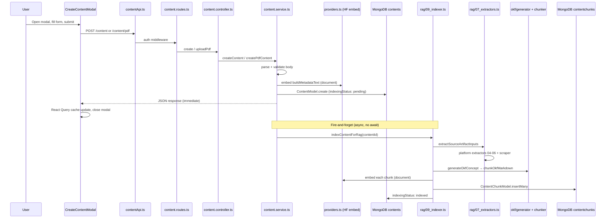
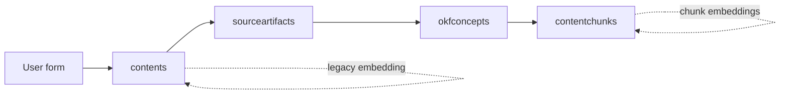

---
tags:
  - conscious
  - interview-prep
  - backend
  - rag
  - save-flow
aliases:
  - Save Flow
  - Index Pipeline
  - Part 3
part: 3
prev: "[[02 - RAG Architecture Overview]]"
next: "[[04 - Search Pipeline]]"
---

# Part 3 — Save & Index Pipeline

← [[00 - Interview Prep Index]] | Prev: [[02 - RAG Architecture Overview]] | Next: [[04 - Search Pipeline]]

End-to-end flow from **opening the create modal** on the dashboard to **background RAG indexing** — the path that makes saved content searchable and chat-able.

Related: [[01 - Backend Folder Structure]] · [[02 - RAG Architecture Overview]]

---

## Overview in one sentence

> User fills the modal → API saves a `content` document immediately with a quick embedding → background job extracts platform data, builds an OKF concept, chunks it, embeds each chunk, and stores them in `contentchunks`.

---

## Full flow diagram



---

## Phase 1 — Frontend: opening the modal to submit

### Where it starts

| File | Role |
|------|------|
| `concious_frontend/src/Pages/dashboard.tsx` | Renders `<CreateContentModal open={contentModalOpen} />` |
| `concious_frontend/src/components/content/CreateContentModal.tsx` | Form UI + submit logic |
| `concious_frontend/src/api/contentApi.ts` | HTTP calls to backend |

### User opens modal

Dashboard toggles `contentModalOpen` → modal shows with fields:

| Field | Purpose | Max length |
|-------|---------|------------|
| **Type** | Youtube, Twitter, Spotify, Article, PDF, Other | — |
| **Title** | Required | — |
| **Link** | Required for link types (not PDF) | — |
| **PDF file** | Required for PDF type | 10 MB |
| **Personal note** | User memory | 1000 chars |
| **Summary** | User summary | 1000 chars |
| **Tags** | Comma-separated | 10 tags |
| **Collection** | Grouping label | 80 chars |
| **Why saved** | Intent / memory hook | 500 chars |
| **Importance** | low / medium / high | — |

### Submit path (`CreateContentModal.tsx`)

`useMutation` calls `submitContent()`:

- **PDF** → `uploadPdfContent()` → `POST /api/v1/content/pdf` (multipart FormData)
- **Link types** → `createContent()` → `POST /api/v1/content` (JSON)

```typescript
// contentApi.ts sends JWT in authorization header
headers: getAuthHeaders()  // { authorization: token }
```

### After success

React Query instantly updates cache — **no refetch needed**:

```typescript
queryClient.setQueryData(["content"], (old = []) => [...old, newContent]);
```

User sees the new card on the dashboard **before** background indexing finishes.

---

## Phase 2 — HTTP layer: routes → controller

### `routes/content.routes.ts`

```text
POST   /           auth → contentController.create
POST   /pdf        auth → pdfUpload → contentController.uploadPdf
GET    /           auth → contentController.list
PATCH  /:id        auth → contentController.update
DELETE /:id        auth → contentController.remove
POST   /:id/reindex auth → contentController.reindexOne
```

Mounted at `/api/v1/content` via `routes/index.ts`.

### `controllers/content.controller.ts`

Thin HTTP layer — no business logic:

| Handler | Service call | Errors |
|---------|--------------|--------|
| `create` | `createContent(userId, req.body)` | 400 validation, 500 server |
| `uploadPdf` | `createPdfContent(userId, file, body)` | 400 validation, 500 upload/Cloudinary |
| `update` | `updateContent(...)` | 404 if not found |
| `remove` | `deleteContent(...)` | 403 if not found |

`req.userId` comes from `middleware/auth.ts` (JWT decode).

---

## Phase 3 — Synchronous save: `content.service.ts`

This is the **fast path** — user gets a response in ~1–3 seconds.

### Step 1: Parse & validate (`parseCreateBody`)

Required: `title`, `link`, `type`

Allowed link types: `youtube`, `twitter`, `spotify`, `article`, `other`

PDF must use `/content/pdf` — rejected if `type === "pdf"` on main route.

Helpers from `utils/contentHelpers.ts`:
- `normalizeTags()` — split, trim, max 10
- `normalizeImportance()` — low / medium / high
- `optionalText()` — trim + max length

### Step 2: Build metadata text (`rag/02_metadata.ts`)

Turns user fields into one indexable text block:

```text
Title: My React hooks article
Type: article
Link: https://...
Tags: react, hooks
Remember this for: interview prep
Personal note: great explanation of useEffect
```

Used for the **document-level embedding** on the `content` document itself (legacy + quick semantic signal).

### Step 3: Document embedding (`providers.ts`)

```typescript
const embedding = await getHfEmbedding(buildMetadataText(input), "document");
```

- Model: `intfloat/e5-small-v2` (384 dimensions)
- E5 prefix: `"passage: "` for documents
- If HF API key missing → `embedding` is null, mode becomes `lexical-fallback`

### Step 4: Save to MongoDB

```typescript
ContentModel.create({
  ...input,
  userId,
  indexingStatus: "pending",  // or "not_indexed" for PDF
  embedding,                  // optional whole-item vector
});
```

### Step 5: Trigger background indexing (fire-and-forget)

```typescript
void indexContentForRag(String(savedContent._id)).catch(console.error);
```

**Critical design choice:** API responds immediately; indexing runs async. Card appears on dashboard while `indexingStatus` is still `pending`.

### Step 6: Response to frontend

```json
{
  "message": "content is added !",
  "mode": "vector",
  "content": { "_id": "...", "title": "...", "indexingStatus": "pending", ... }
}
```

### PDF variant (`createPdfContent`)

1. Validate PDF mime + size (10 MB)
2. Upload buffer to **Cloudinary** (`providers/cloudinary.ts`)
3. Store `fileMetadata` (publicId, secureUrl, filename, bytes)
4. `link` = Cloudinary secure URL
5. Same embedding + create + background `indexContentForRag`

### Update also re-indexes

`updateContent()` refreshes document embedding and calls `indexContentForRag()` again.

`deleteContent()` cascades: deletes chunks, artifacts, OKF concepts, and Cloudinary PDF if applicable.

---

## Phase 4 — Background indexing: `rag/09_indexer.ts`

`indexContentForRag(contentId)` is the **main RAG ingest pipeline**.

### Status lifecycle on `content`

```text
pending → (success) indexed
pending → (error)   failed  (+ indexingError message)
```

### Step-by-step inside indexer

#### 1. Reset previous index data

Deletes all existing for this content:
- `ContentChunkModel` (old chunks)
- `SourceArtifactModel` (old artifacts)
- `OkfConceptModel` (old OKF doc)

Ensures re-index is idempotent.

#### 2. Metadata artifact (always created)

`buildMetadataText()` from saved content fields → stored as:

```text
SourceArtifact {
  artifactType: "metadata",
  provider: "user",
  rawText: "Title: ...\nType: ...\n...",
  extractionStatus: "success" | "skipped"
}
```

#### 3. Platform extraction

Calls `extractSourceArtifactInputs()` from `rag/07_extractors.ts` — see Phase 5 below.

Each result → `createPlatformArtifact()` → saved to `sourceartifacts`.

Side effects on `content` document:
- `sourceMetadata` — enriched platform fields (artist, video title, etc.)
- `extractedText` — main body text if extraction succeeded and length > 100 chars

#### 4. Generate OKF concept

`generateOkfConcept()` from `okf/generator.ts` — see Phase 6.

Saved to `okfconcepts` collection with `bodyMarkdown`, `slug`, `tags`, `sourceTypes`.

#### 5. Chunk OKF markdown

`chunkOkfMarkdown()` from `okf/chunker.ts` — see Phase 7.

Returns array of `{ body, metadataText, chunkText, heading, sectionPath }`.

#### 6. Embed each chunk

For each OKF chunk:

```typescript
const embedding = await getHfEmbedding(okfChunk.chunkText, "document");
```

Skipped if HF returns null. If **zero** chunks get embeddings → indexing fails.

#### 7. Insert chunks

`ContentChunkModel.insertMany(chunkDocs)` — each chunk has:

| Field | Value |
|-------|-------|
| `contentId`, `userId` | Parent scoping |
| `okfConceptId`, `okfSlug` | OKF provenance |
| `body`, `metadataText`, `chunkText` | Searchable text layers |
| `embedding` | 384-dim vector |
| `sourceType` | `"okf_concept"` |
| `chunkIndex` | Order in document |
| `embeddingModel` | `intfloat/e5-small-v2` |
| `chunkingVersion` | `"v2"` |

#### 8. Mark success

```typescript
content.indexingStatus = "indexed";
content.lastIndexedAt = new Date();
```

On error → `indexingStatus: "failed"`, `indexingError` set.

---

## Phase 5 — Platform extraction: `07_extractors.ts` + `04–06`

### Entry point

`extractSourceArtifactInputs(content)` uses `detectPlatform()` from `01_platform.ts`:

```text
content.type (youtube, spotify, ...) 
  OR hostname from link (youtube.com, spotify.com, x.com, ...)
  → PlatformType
```

### Routing table

| Platform | Extractor | Artifact type(s) | Provider |
|----------|-----------|------------------|----------|
| `youtube` | `extractYoutube` | `youtube_transcript` or `youtube_description` | youtube |
| `spotify` | `extractSpotify` | `spotify_metadata` | spotify |
| `twitter` | `extractTwitter` | `twitter_thread` | twitter |
| `article` | `extractArticleLike` | `article` | scraper |
| `other` (with link) | `extractArticleLike` | `article` | scraper |
| `pdf` | `buildPdfExtraction` | `pdf_text` (skipped) | pdf |

### `04_youtube.ts`

- `parseYoutubeVideoId(url)` — handles `youtube.com?v=`, `youtu.be/`, `/shorts/`, `/embed/`
- `fetchYoutubeTranscript(videoId)` — uses `youtube-transcript` npm package
- **Priority:** transcript first (best for RAG). If no captions → fallback to oEmbed description (title + channel name)

### `05_spotify.ts`

- `parseSpotifyUrl(url)` — `open.spotify.com/{type}/{id}`
- `fetchSpotifyMetadata(url)` — tries Spotify Web API (if credentials), then oEmbed
- Builds `rawText` with title, artist, album, description + user context fields

### `06_twitter.ts`

- `parseTwitterUrl(url)` — `twitter.com|x.com/:user/status/:tweetId`
- `fetchTwitterMetadata(url)` — Twitter oEmbed + Open Graph HTML scrape
- Builds tweet text, username, description for indexing

### `03_scraper.ts` (used by article/other)

- `extractReadableArticle(url)` — Mozilla Readability + JSDOM
- Extracts main article text, title, author, site name
- Minimum useful body: **100 characters**

### Extraction result shape

Each extractor returns `SourceArtifactExtractionResult`:

```typescript
{
  artifactType,       // e.g. "youtube_transcript"
  provider,             // e.g. "youtube"
  sourceUrl,
  rawText,              // full extracted text
  bodyText,             // main indexable body (if long enough)
  extractionStatus,     // "success" | "failed" | "skipped"
  extractionQuality,    // e.g. "captions", "readability", "oembed+user-context"
  metadata,             // platform-specific fields
  sourceMetadata,       // denormalized fields → saved on content.sourceMetadata
}
```

---

## Phase 6 — OKF concept: `okf/generator.ts`

**OKF** = structured markdown knowledge document — the bridge between raw artifacts and searchable chunks.

### Input

```typescript
generateOkfConcept({
  content: { title, link, type, summary, personalNote, whySaved, tags, ... },
  sourceArtifacts: [ metadata artifact, platform artifacts... ]
})
```

### Output: `GeneratedOkfConcept`

| Field | Description |
|-------|-------------|
| `title`, `slug` | Display title + URL-safe slug |
| `summary` | User summary or auto-generated one-liner |
| `bodyMarkdown` | Full structured markdown document |
| `tags`, `collection`, `importance` | Copied from content |
| `sourceTypes` | List of artifact types used |
| `generatedFrom` | `"source_artifacts"` or `"metadata_only"` |

### Markdown structure

```markdown
---
title: "..."
type: "okf_concept"
tags: [...]
generatedFrom: "source_artifacts"
---

# Title

## Summary
...

## User Context
- Personal note: ...
- Remember this for: ...
- Tags: ...

## Extracted Knowledge
### youtube_transcript
- type: youtube_transcript
- status: success
[transcript text capped at 30k chars]

## Sources
- type: metadata (success)
- type: youtube_transcript (success)
```

### Key logic

- Skips `metadata` artifact in Extracted Knowledge section (already in User Context)
- Caps raw artifact text at 30k total budget, 8k per section
- `generatedFrom: "source_artifacts"` only if at least one non-metadata artifact has successful extracted text

---

## Phase 7 — OKF chunking: `okf/chunker.ts`

Splits the OKF markdown into embeddable units for vector search.

### Process

1. **Strip YAML frontmatter** from `bodyMarkdown`
2. **Split by headings** (`#`, `##`, `###`) into sections (Summary, User Context, Extracted Knowledge, etc.)
3. **Split long sections** — max 1200 chars per chunk, up to 12 chunks
4. **Build chunk text** for embedding:

```text
Context: Title: My Video
Summary: ...
Tags: react
Source: okf_concept

Chunk Content:
[section body text]
```

5. Each chunk gets `tokenCount`, `charLength`, optional `heading`, `sectionPath`

### Why chunk at OKF level (not raw transcript)?

- Every chunk carries **metadata prefix** (title, tags, summary) → better retrieval
- Structured sections → User Context and Extracted Knowledge searchable separately
- Consistent format across all content types (YouTube, article, Spotify, etc.)

---

## Data written at each stage



| Stage | Collection | When | Searchable? |
|-------|------------|------|-------------|
| Sync save | `contents` | Immediate | Legacy vector on whole item |
| Metadata artifact | `sourceartifacts` | Background | Indirect (via OKF chunks) |
| Platform artifact | `sourceartifacts` | Background | Indirect |
| OKF concept | `okfconcepts` | Background | Indirect |
| **Chunks** | `contentchunks` | Background | **Primary RAG target** |

---

## Indexing status — what the user sees

Dashboard cards show content immediately. `indexingStatus` on the document:

| Status | Meaning |
|--------|---------|
| `pending` | Background indexing in progress |
| `indexed` | Chunks ready — search + chat fully powered |
| `failed` | Indexing error — lexical fallback still works on content fields |
| `not_indexed` | PDF just created, indexing not started yet |

Manual re-trigger: `POST /api/v1/content/:id/reindex` or bulk `POST /api/v1/reindex-embeddings`.

---

## File reading checklist (Day 2)

Read in this exact order:

1. `concious_frontend/src/components/content/CreateContentModal.tsx` — form + submit
2. `concious_frontend/src/api/contentApi.ts` — HTTP calls
3. `concious_backend/src/routes/content.routes.ts`
4. `concious_backend/src/controllers/content.controller.ts`
5. `concious_backend/src/services/content.service.ts` — sync save + trigger
6. `concious_backend/src/rag/02_metadata.ts` — metadata text builder
7. `concious_backend/src/rag/09_indexer.ts` — full index pipeline
8. `concious_backend/src/rag/07_extractors.ts` — platform router
9. `concious_backend/src/rag/04_youtube.ts` + `05_spotify.ts` + `06_twitter.ts`
10. `concious_backend/src/okf/generator.ts` + `okf/chunker.ts`

---

## Interview talking points

1. **Fast write, slow index** — user never waits for transcript scraping or multi-chunk embedding.
2. **Two embedding levels** — document-level on `content` (legacy fallback), chunk-level on `contentchunks` (primary RAG).
3. **Artifacts are raw, OKF is structured, chunks are searchable** — three-layer knowledge pipeline.
4. **Platform-aware extraction** — YouTube tries transcript first; articles use Readability; Spotify/Twitter use API + oEmbed.
5. **Idempotent re-index** — delete old chunks/artifacts/OKF before rebuilding.
6. **Graceful degradation** — if HF is down, content still saves; search falls back to lexical; indexing may fail but item exists.

### One-liner for interview

> "When a user saves content, we immediately persist it to MongoDB with a metadata embedding, then asynchronously run a pipeline: extract platform-specific text into source artifacts, synthesize a structured OKF markdown document, chunk it with metadata prefixes, embed each chunk with HuggingFace e5-small-v2, and store them in contentchunks for hybrid vector+lexical search and grounded chat."

---

← [[02 - RAG Architecture Overview]] | Next: [[04 - Search Pipeline]]
